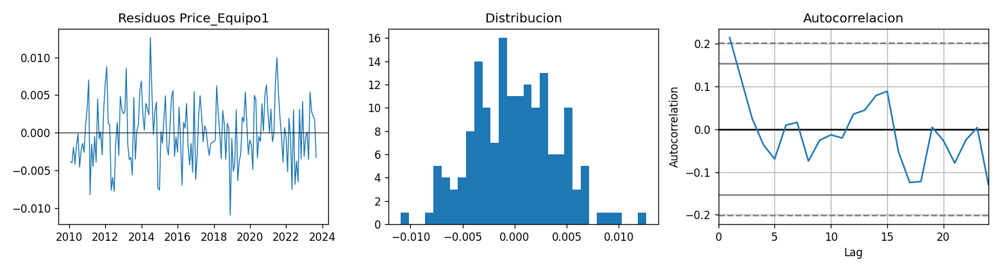
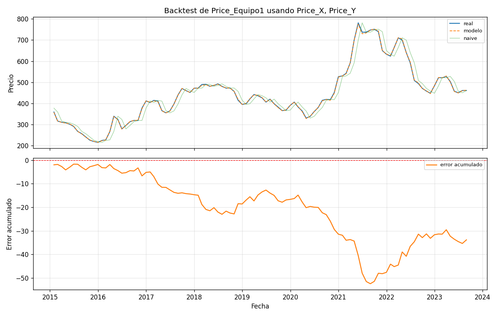
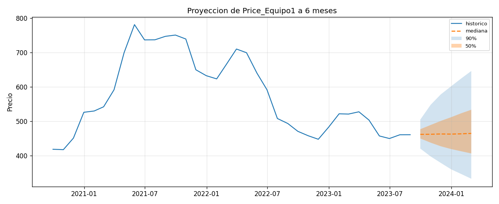

# Informe final respecto a los hallazgos encontrados
Brandon Enrique Eroza Torres: tbdonran.23@gmail.com

## Resumen
El análisis se identificó, el precio de cada equipo se comporta de manera diferente, por ejemplo el **Equipo 1** depende de un 97% de la materias prima Y cerca del 98%, y el **Equipo 2** en un 76% de Z. En el X.csv aunque es bastante significativa, tiene un pero menor al 4% en ambos casos(esto se puede visualizar en el dashboard adjunto).

El modelo alcanza un error histórico de 0.33% cuando los precios de las materias primas del mes se vinculan, el prognóstico no está en el modelo, sino en un futuro de 6 meses, a mas del 95% del error proviene de no saber donde estaran esas materias primas.

La proyección a 6 meses entrega rangos de confianza del 90% que pueden ir variando de acuerdo al primer mes que puede ser de 9% hasta el sexto mes que puede ser 34%. Mi recomendacion es basicamente presupuestar con el rango y priorizar la negociación.

Más información en los siguientes enlaces:
- 1. [Notebook con el análisis completo](notebook/pre_ingesta.ipynb)
- 2. [Reporte de arquitectura](arquitectura/arquitectura.md)
- 3. [Dashboard](reporte.pdf)

## 1. Explicación del caso

Una constructora de obras, realiza de manera habitual la compra de dos tipos de equipos cuya determinación final del precio queda a disposcion en la naturaleza del comportamiento de tres de las materias primas (que son el conjunto de la X, la Y, la Z). Existen discrepancias en la forma de determinar de cuáles insumos dependen realmente los precios de cada equipo, así como también la dificultad para anticipar estos costos puede originar sesgos de acuerdo a la forma que se manejan todos estos datos.

El planteamiento de la solución conecta con el modelo de negocio de la empresa y pasa por la identificación de las relaciones entre materias primas y equipos, la construcción de una proyección de costos de carácter mensual que contemple la incertidumbre, la implementación de un agente de IA que sea capaz de contestar sobre los resultados cruzándolos con la información de contexto del mercado, así como el planteamiento de una arquitectura cloud para pasar a producción la solución (el reporte lo pueden encontrar bajo el título: reporte_arquitectura.md)

En otras palabras, se trata de anticipar los costos de los P, los cuales mediante rangos nos permitirán minimizar las desviaciones presupuestarias de los P y mostrar elementos objetivos para la negociación con proveedores.

## 2. Supuestos

- **Fuentes:** los archivos individuales(x.CSV,Y.csv,Z.csv) los valide contra historicos_equipos.csv, encontre 0 discrepancias en 3530 fechas comunes, con diferencia maxima de 0.00000, use los individuales porque cubren mas periodo (X llegar a Abril 2024)

- **Huecos en el calendario:**las 105 celdas vacías en días hábiles corresponden a festivos y días sin cotización, no a datos perdidos (días libres), en estos casos ocupe el metodo LOCF(Last observation carried forward), lo cual lo limite a 5 días hábiles,para no extender el supuesto precio constante más alla de donde se sostiene.

- **Celdas no imputadas:**las 3 celdas del 2010-01-01 se dejaron vacías y la razón del porque estan vacias es porque LOCF arrastra el ultimo valor registrado y en esa fecha todavia no hay fecha registrada.

- **Frecuencia de análisis:**la materia Y se repite el mismo valor del 55.7% de los días, no es una serie diaria real aunque el archivo tenga una fila por día.

- **Agregación:**lo que me pude dar cuenta, ademas, es que el precio de compra de un equipo refleja el costo de los insumos durante el periodo de producción.

- **El formato de fechas Y.csv:**interpretado como DD/MM por consistencias interna entre las fechas por ejemplo: 12/9, 11/9, 8/9 y 7/9 en orden descendente.

# 3. Formas para resolver el caso y la opción tomada

Estos son los casos alternos importante que considere y descarte, los presento en tabla

| Alternativa considerada | Motivo del descarte |
|---|---|
| Usar historico_equipos.csv como fuente | Idéntico a los archivos individuales donde se solapan, pero con siete meses menos de cobertura |
| Modelo con materias rezagadas | El mejor rezago es k=0 en los seis pares equipo-materia; ninguna materia anticipa a los equipos |
| Cierre de mes como agregación | El promedio mensual da mejor ajuste (R² 0.9998 vs 0.9930) y mejor lectura económica |
| Ventana rodante en el backtest | MAPE 0.336% contra 0.331% de la expansiva: empate que confirma coeficientes estables; gana la que usa toda la información |
| Z en el modelo del Equipo 1 | p = 0.069, coeficiente negativo sin interpretación económica, y MAPE idéntico al excluirla |
| Random walk puro para simular materias | Los retornos tienen autocorrelación AR(1) de 0.24 a 0.42; hay inercia que el RW descarta |
| Intervalos analíticos de statsmodels | Solo capturan el error del modelo de costos (banda < 1%); ignoran la fuente dominante de incertidumbre, que son las exógenas |
| scikit-learn como librería de modelado | El caso pide identificar qué variables explican el comportamiento, un problema de inferencia. Se requieren p-valores, errores estándar y diagnósticos de residuos, que sklearn no provee |
| Horizonte de 12 meses | La banda de 26% que ya no informa ninguna decisión de presupuesto |

# 4. Resultado de análisis de los datos y los modelos

## El diagnóstico que definió la especificación

Contruí un modelo que aparentaba estar bien con un 99% del comportamiento con los precios (R^2 = 0.993), pero cuando revisé sus errores encontre que se alternaban como péndulo, uno arriba y el siguiente abajo. Con valores respecto a autocorrelacion = -0.44 y Durbin watson= 2.86 (Durbin-watson es una prueba de estadistica para si hay correlacion de primer orden en los errores o residuos).

La razon del porque ocurre es cuando le aplique una transformacion de más a los datos. Pues trabajar con las variaciones de precios mes a mes resulta, en ciertos casos correcto; pero cuando no lo son, la transformación arruina la relacion de origen. 

## Especificación
| Equipo | Variables | Elasticidades | R² | Suma de elasticidades |
|---|---|---|---:|---:|
| Equipo 1 | X, Y | X: 0.033 · Y: 0.972 | 0.9998 | 1.00 |
| Equipo 2 | X, Y, Z | X: 0.028 · Y: 0.205 · Z: 0.760 | 0.9995 | 0.99 |

Las elasticidades sumen 1 implica retornos constantes, en otras palabras, si todos los insumos suben 10% el equipo sube 10%. Por lo que me dice que se comporta como una canasta ponderada de sus insumos.

Z (price_z) queda fuera en consideracion del equipo1 1 porque su P = 0.069 y con coeficiente negativo.

## Validación fuera de muestra

Backtest con ventan expansiva, en cada se mes se va reajusando solo usando la informacion previsa, y predice el mes siguiente.

| Equipo | MAPE modelo | MAPE naive | Reducción del error |
|---|---:|---:|---:|
| Equipo 1 | 0.331% | 4.995% | 93.4% |
| Equipo 2 | 0.355% | 3.553% | 90.0% |

## Limitaciones
- El model del equipo 2 conserva autoorrelacion positiva en los residuos
(DW = 1.17 y Ljung-box < 0.001)
- X es estadísticamente significativa(t=29) pero economicamente menor

# 5. Proyección de costos y horizonte de predicción

## Justificación del horizonte

Con el fin de conocer qué tan lejos vale la pena pronosticar, medí el error de dos formas: una suponiendo que ya conozco los precios de las materias primas del mes que quiero predecir, y otra teniendo que adivinarlos también.

La diferencia entre ambas cuenta toda la historia. Cuando conozco las materias, el modelo casi no falla y ese error no va creciendo con el tiempo (se queda en 0.35% pronostique a 1 mes o a 12). Cuando tengo que adivinarlas, el error va creciendo mes a mes (4.5% subida en el primer mes, 26% al cabo de un año).

| Horizonte | Error condicional | Error total |
|---|---:|---:|
| 1 mes | 0.34% | 4.5% |
| 3 meses | 0.35% | 11.3% |
| 6 meses | 0.37% | 16.6% |
| 12 meses | 0.39% | 26.4% |

Elegí 6 meses como límite por una razón práctica: a 6 meses el rango de precios todavía sirve para apartar un colchón de presupuesto con criterio (16%). A 12 meses el rango es tan ancho (26%) que ya no ayuda a decidir nada.

## Alcance honesto del pronóstico

Aquí reporto lo que es la proyeccion de mi pronóstico  contra el método más simple posible.

| Mes | Equipo 1 | Equipo 2 |
|---|---|---|
| 2023-09 | 462 [421 – 505] | 926 [864 – 983] |
| 2023-10 | 462 [398 – 548] | 929 [827 – 1027] |
| 2023-11 | 463 [379 – 578] | 930 [804 – 1059] |
| 2023-12 | 463 [360 – 602] | 931 [786 – 1088] |
| 2024-01 | 464 [346 – 626] | 931 [766 – 1115] |
| 2024-02 | 465 [333 – 647] | 932 [750 – 1138] |

¿Y por qué? porque el precio del equipo es la suma de los ingredientes, y los ingredientes recorren una secuencia casi impredecible. Si los ingredientes son impredecibles, el equipo hereda esta impredecibilidad, y no hay ningún modelo que le gane a la moneda a cara o cruz prediciendo una moneda a cara o cruz.

# 6. Futuros ajustes o mejoras

 - 1. **Monitoreo**: importante monitorear las elasticidades, si la suma se aleja de 1, el modelo debe reestimarse ya que posiblemente cambio la estructura de sus costor, en mi opinion no es dificil de implementar y es como una alerta.
 - 2. **Reentrenamiento mensual automatizado:** es importante contemplar la estructura cloud y hacer comparacion masiva de que conviene para estos casos, en mi caso por el tiempo limite desarrolle un reporte simple sobre la arquitectura azure (los costos pueden variar)

 - 3. **Mejora al agente IA:** El prototipo ya cubre con 4 funciones que es el pronóstico, explicar el model, simular escenarios y buscar contexto del mercado, lo que faltaria es hacer mas dinamico de manera que se vaya actualizando ya sea con el presepuesto actual de empresa y así como tambien generar reportes en automatico en PDF o Excel, se podria pero llevaria tiempo.

# 7. Apreciaciones 

Agradezco la oportunidad de participar en el proceso. El caso me gustó porque combina varios aspectos que un científico de datos debe considerar y no se resuelve con una sola técnica.

Sin duda alguna, la primera fase de ingestar los datos fue lo mas laborioso de realizar, porque necesito entender como estan compuestos los datos y tener contexto de los mismo. Si tuviera mas tiempo pudiera perfecionar el agente IA para tener mas precisión.

# 8. Referencias

- Documentación de statsmodels: https://www.statsmodels.org/stable/index.html
- Series de tiempo en pandas:https://pandas.pydata.org/docs/user_guide/timeseries.html
- LOCF en series financieras: https://tradingstrategy.ai/glossary/forward-fill
- Imputación de series financieras (arXiv): https://arxiv.org/pdf/2506.01696

